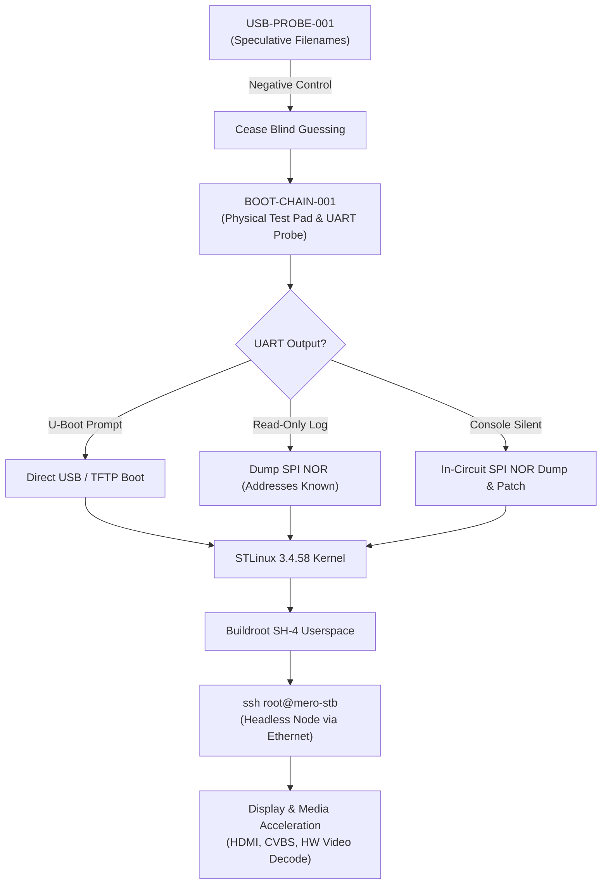

# Mero STB Lab (`mero-stb-lab`)

Reverse engineering, hardware archaeology, and custom Linux bring-up for the **Sagemcom DSI74 V2 HD GVT** satellite set-top box platform, powered by the **STMicroelectronics STiH237** ("Cardiff") multimedia SoC.

The primary objective is to obtain execution of software we control, boot a minimal headless Linux environment with Ethernet and SSH, and repurpose the hardware as a small, versatile network node (**Mero-STB**).

---

## Hardware Identity

```text
Chassis Model:   Sagemcom DSI74 V2 HD GVT - BRA
PCB Markings:    M74X-1 / 25353567/99-A
Power Supply:    12 V / 2.0 A DC (Center-positive barrel jack)
SoC:             STMicroelectronics STiH237 (Cardiff family, ST40 / SH-4 core)
System RAM:      Elpida J4216EFBG (DDR3 SDRAM)
Storage Flash:   Micron BGA (Marked "3QD17...", SLC NAND flash)
Display/Keys:    Princeton Tech PT6958 (28-pin SOP, LED driver & key-scanner)
Boot Flash:      SPI NOR Flash (Candidate under physical/schematic mapping)
Rear I/O:        HDMI, CVBS Video, YPbPr Component, Stereo Audio, Coaxial S/PDIF,
                 10/100 Ethernet (MAC: 68:15:90:6B:81:96), USB 2.0 Host, F-Type Satellite In
```

> **Thermal Notice:** The large aluminum heat-spreader shield makes direct contact with the STiH237 through a thermal interface pad. It **must be securely re-seated** prior to any prolonged powered operation to avoid thermal degradation.

---

## Project Status & Active Milestones



- **[USB-PROBE-001](docs/experiments/usb-probe-001.md): COMPLETED (RESULT: NEGATIVE)**  
  The receiver powers/accesses the USB flash drive, but the observed "updating firmware" cold-boot screen occurs identically without any USB drive present. Blind filename probing has been terminated.
- **[BOOT-CHAIN-001](docs/boot-chain/boot-chain-001.md): ACTIVE PHASE**  
  Physical boot-chain archaeology, test point tracing, logic-level verification, and passive UART logging during cold-boot.

---

## Repository Structure

```text
mero-stb-lab/
├── docs/
│   ├── hardware/
│   │   ├── overview.md            # Detailed physical unit specifications & UI observations
│   │   ├── soc-stih237.md         # STiH237 Cardiff core, architecture & thermal rules
│   │   ├── memory-mapping.md      # Classification of RAM, NAND, PT6958, and SPI NOR
│   │   └── network-recon.md       # Network tests, port scan results & traffic analysis
│   ├── boot-chain/
│   │   ├── architecture.md        # Staged boot hypothesis & secure boot uncertainty
│   │   └── boot-chain-001.md      # Primary investigation plan: test pads, UART & decision matrix
│   └── experiments/
│       └── usb-probe-001.md       # Full report & negative control of USB recovery probe
├── research/
│   ├── stih237-platform.md        # Silicon pinouts, JTAG 1.8V warning, UART configuration
│   └── dsiw74-comparison.md       # Sibling DSIW74 findings (locked JTAG, flash encryption)
├── tools/
│   └── prepare-usb-probe.sh       # Automated, safe USB probe formatting script
├── buildroot/
│   └── README.md                  # Buildroot SH-4 userspace package manifesto
├── kernel/
│   └── README.md                  # STLinux 3.4.58 BSP kernel strategy
├── probes/
│   └── usb-001/                   # Probe 001 reference payload files
├── .gitignore
└── README.md
```

---

## Working Philosophy & Guardrails

1. **Pragmatic Hardware Work:** We use soldering, wire leads, test pads, logic analyzers, and general-purpose Linux interfaces. We do not rely on expensive proprietary commercial flashers as a prerequisite.
2. **Electrical Safety:** JTAG on the STiH237 runs at **1.8V logic**. Never connect 3.3V/5V equipment without verified bidirectional level shifting. Never apply unverified voltages to unknown test pads.
3. **Preservation First:** Always take multiple, byte-verified binary SHA-256 dumps before executing any write operations to nonvolatile storage.
4. **IP & Copyright Cleanliness:** Never commit proprietary vendor firmware blobs to public git. Only extraction scripts, memory maps, hashes, and open-source custom components are committed.
