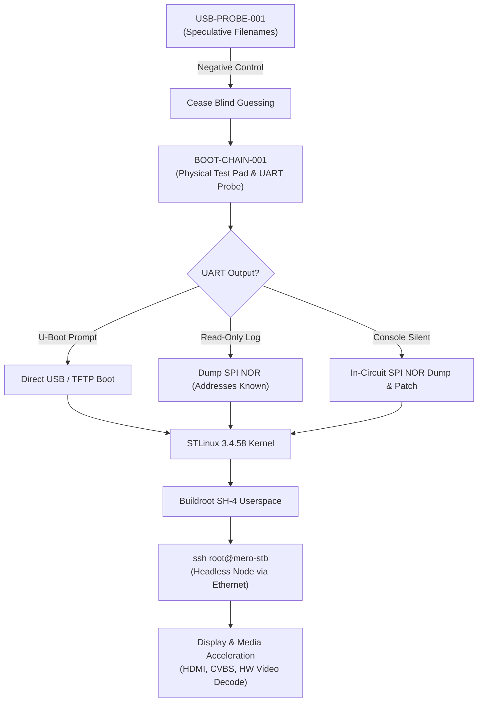

# Mero STB Lab (`mero-stb-lab`)

Reverse engineering, hardware archaeology, and custom Linux bring-up for the **Sagemcom DSI74 V2 HD GVT** satellite set-top box platform, powered by the **STMicroelectronics STiH237** ("Cardiff") multimedia SoC.

The primary objective is to obtain execution of software we control, boot a minimal headless Linux environment with Ethernet and SSH, and repurpose the hardware as a small, versatile network node (**Mero-STB**).

---

## Hardware Identity

```text
Chassis Model:   Sagemcom DSI74 V2 HD GVT - BRA
PCB Markings:    M74X-1 / 25353567/99-A
Power Supply:    12 V / 2.0 A DC (Center-positive barrel jack)
SoC:             STMicroelectronics STiH237 (Cardiff family, ST40 / SH-4 core)
System RAM:      Elpida J4216EFBG (DDR3 SDRAM)
Storage Flash:   Micron BGA (Marked "3QD17...", SLC NAND flash)
Display/Keys:    Princeton Tech PT6958 (28-pin SOP, LED driver & key-scanner)
Boot Flash:      SPI NOR Flash (Candidate under physical/schematic mapping)
Rear I/O:        HDMI, CVBS Video, YPbPr Component, Stereo Audio, Coaxial S/PDIF,
                 10/100 Ethernet (MAC: 68:15:90:6B:81:96), USB 2.0 Host, F-Type Satellite In
```

> **Thermal Notice:** The large aluminum heat-spreader shield makes direct contact with the STiH237 through a thermal interface pad. It **must be securely re-seated** prior to any prolonged powered operation to avoid thermal degradation.

---

## Project Status & Active Milestones



- **[Full Project Roadmap & Zero-Cost Strategy](ROADMAP.md)**: Details the active $0-budget exploration routes (HTTP endpoint emulation, front-panel boot straps, and USB keyboard console probe).
- **[USB-PROBE-001](docs/experiments/usb-probe-001.md): COMPLETED (RESULT: NEGATIVE)** — Blind filename probing terminated.
- **[USB-SCRIPT-002](docs/experiments/usb-script-002.md): COMPLETED (RESULT: NEGATIVE)** — Conventional U-Boot script discovery verified negative.
- **[NET-PATH-003](docs/experiments/net-path-003.md): COMPLETED (RESULT: POSITIVE)** — Verified Layer 2/3 relay, captured boot DNS (`ucstb.vivoplay.com.br`), outbound HTTP endpoints (`186.215.183.217:80`, `191.32.31.251:80`), firmware version `1.320.1.0.5`, and error `05NW`.
- **[NET-PROVISION-004](docs/experiments/plan-net-provision-004.md): ACTIVE PHASE** — Local HTTP endpoint emulation to capture raw unencrypted GET/POST requests and explore network provisioning.
- **[NET-CONFIG-005](docs/experiments/net-config-005.md): COMPLETED (RESULT: POSITIVE)** — Demonstrated foreground custom SVG application rendering, supplied ECMAScript execution, HTTP callbacks, and script-controlled navigation in the stock Ekioh runtime. Periodic timer/DOM updates remain unverified.
- **[APP-RUNTIME-006](docs/experiments/app-runtime-006.md): COMPLETED (RESULT: POSITIVE)** — Demonstrated continuous foreground updates, recursive timers, DOM mutations, XHR/`getURL()` polling, refreshed SVG frames, and 35 remote-control key codes.
- **[REMOTE-MAP-007](docs/experiments/remote-map-007.md): COMPLETED (RESULT: POSITIVE)** — Captured 40/40 named OEM remote-button mappings and published the canonical keymap.
- **[APP-API-009](docs/experiments/app-api-009.md): COMPLETED (RESULT: POSITIVE, LIMITED)** — Demonstrated network/storage browser primitives and `ekiohPlatformInfo`; common native media, DVB, filesystem, and USB bridges were absent. APP-EXIT-008 was negative.
- **[APP-API-009B + MEDIA-010](docs/experiments/app-api-009b-media-010.md): COMPLETED (RESULT: POSITIVE, LIMITED)** — Found raw Ekioh connection/server helpers and a scriptable-plugin MIME; SVG audio fetched the WAV but produced no audible playback. Receiver-authorized host cleanup worked.
- **[APP-API-009C](docs/experiments/app-api-009c.md): COMPLETED (RESULT: POSITIVE, LIMITED)** — Real Ekioh client/server socket objects found; the default-state outbound attempt did not connect and the tested receiver listener remained LAN-filtered.
- **[APP-API-009D](docs/experiments/app-api-009d.md): COMPLETED (RESULT: POSITIVE, LIMITED)** — Confirmed cross-boot `localStorage`; socket activation and XHTML-in-SVG plugin instantiation remained unresolved.
- **[APP-API-009E](docs/experiments/app-api-009e.md): COMPLETED (RESULT: POSITIVE, LIMITED)** — Mapped advertised module, Ekioh transport, DOM/XML/storage/timer surfaces; concurrent result flooding stalled the final inventory.
- **[APP-NATIVE-018](docs/experiments/app-native-018.md): COMPLETED (RESULT: LIMITED, NEGATIVE)** — A controlled dynamic XHTML `<embed>` remained an ordinary `SVGElement`; no scriptable native-plugin object was exposed.
- **[RUNTIME-MAP-009F](docs/experiments/runtime-map-009f.md): COMPLETED (RESULT: POSITIVE)** — Automatic sequential mapping completed; exposed native timer objects and corrected boot identity using exact ARP validation.
- **[RUNTIME-PROBE-009G](docs/experiments/runtime-probe-009g.md): COMPLETED (RESULT: POSITIVE)** — Native timer lifecycle, UTF-8 binary round trip, DOM events, JSON/storage, intervals, and heap behavior verified in one automatic launch.
- **[APP-HUB-010](docs/experiments/app-hub-010.md): COMPLETED (RESULT: POSITIVE)** — The persistent foreground hub hot-loads versioned experiment modules without additional cold boots or remote actions.
- **[USB-CAP-012](docs/experiments/usb-cap-012.md): COMPLETED (RESULT: NEGATIVE, LIMITED)** — Ekioh rejected tested local-file and USB URI reads; OS-level USB detection remains unknown.
- **[FW-UPDATE-013](docs/experiments/fw-update-013.md): IN PROGRESS** — ARP pass-through capture was retired after a brief LAN disruption; offline service, archive, and firmware-package discovery continues.
- **[Isolated Ethernet Receiver Lab](docs/tooling/isolated-ethernet-lab.md)** — Direct-cable DHCP/DNS/HTTP/pcap tooling with reproducible connection, analysis, and cleanup steps; no ARP spoofing.
- **[NETWORK-SERVICE-011](docs/experiments/network-service-011.md): COMPLETED (RESULT: NO LAN-REACHABLE SERVICE IDENTIFIED)** — All TCP ports silently filtered; bounded UDP and passive probes identified no responding maintenance or discovery service.

---

## Repository Structure

```text
mero-stb-lab/
├── docs/
│   ├── hardware/
│   │   ├── overview.md            # Detailed physical unit specifications & UI observations
│   │   ├── soc-stih237.md         # STiH237 Cardiff core, architecture & thermal rules
│   │   ├── memory-mapping.md      # Classification of RAM, NAND, PT6958, and SPI NOR
│   │   └── network-recon.md       # Network tests, port scan results & traffic analysis
│   ├── boot-chain/
│   │   ├── architecture.md        # Staged boot hypothesis & secure boot uncertainty
│   │   └── boot-chain-001.md      # Primary investigation plan: test pads, UART & decision matrix
│   └── experiments/
│       └── usb-probe-001.md       # Full report & negative control of USB recovery probe
├── research/
│   ├── stih237-platform.md        # Silicon pinouts, JTAG 1.8V warning, UART configuration
│   └── dsiw74-comparison.md       # Sibling DSIW74 findings (locked JTAG, flash encryption)
├── tools/
│   └── prepare-usb-probe.sh       # Automated, safe USB probe formatting script
├── buildroot/
│   └── README.md                  # Buildroot SH-4 userspace package manifesto
├── kernel/
│   └── README.md                  # STLinux 3.4.58 BSP kernel strategy
├── probes/
│   └── usb-001/                   # Probe 001 reference payload files
├── .gitignore
└── README.md
```

---

## Working Philosophy & Guardrails

1. **Pragmatic Hardware Work:** We use soldering, wire leads, test pads, logic analyzers, and general-purpose Linux interfaces. We do not rely on expensive proprietary commercial flashers as a prerequisite.
2. **Electrical Safety:** JTAG on the STiH237 runs at **1.8V logic**. Never connect 3.3V/5V equipment without verified bidirectional level shifting. Never apply unverified voltages to unknown test pads.
3. **Preservation First:** Always take multiple, byte-verified binary SHA-256 dumps before executing any write operations to nonvolatile storage.
4. **IP & Copyright Cleanliness:** Never commit proprietary vendor firmware blobs to public git. Only extraction scripts, memory maps, hashes, and open-source custom components are committed.
