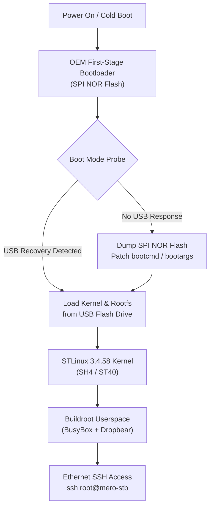

# Mero STB Lab (`mero-stb-lab`)

Reverse engineering, hardware hacking, and custom Linux bring-up for the **Sagemcom DSI74** set-top box platform, powered by the **STMicroelectronics STiH237** ("Cardiff") multimedia SoC.

---

## Hardware Profile

| Parameter | Specification |
| :--- | :--- |
| **Device** | Sagemcom DSI74 Family (Ex-GVT Receiver) |
| **SoC** | STMicroelectronics STiH237 ("Cardiff") |
| **Core Architecture** | SuperH SH-4 / ST40-300 |
| **RAM** | 256 MB DDR SDRAM |
| **Boot Flash** | Serial SPI / NOR Flash |
| **System Storage** | Parallel NAND Flash |
| **I/O & Networking** | 10/100M Ethernet, USB 2.0 Host, HDMI, CVBS, S/PDIF, Smartcard |

---

## Architectural Roadmap

The goal is to turn this retired proprietary TV receiver into a lightweight, headless embedded Linux machine with SSH access:



### Strategic Milestones
1. **Phase 0: Non-Invasive USB Probe (In Progress)**
   - Test whether OEM bootloader checks USB storage for recovery or update images during cold boot.
   - Preserves internal flash integrity entirely.
2. **Phase 1: Boot Flash Extraction (Fallback)**
   - Dump SPI NOR flash with external programmer.
   - Inspect strings, extract U-Boot environment, patch `bootcmd` for USB boot fallback.
3. **Phase 2: Minimal Linux Bring-up (`Mero-STB v0.1`)**
   - Reconstruct STLinux 3.4.58 BSP with STiH237 Cardiff support.
   - Build SH-4 Buildroot userspace with DHCP, Dropbear SSH, and BusyBox.
4. **Phase 3: Hardware Peripherals**
   - DirectFB / Framebuffer output over HDMI and CVBS.
   - Hardware accelerated video decoding using Cardiff silicon features.

---

## Repository Structure

```text
mero-stb-lab/
├── docs/
│   ├── hardware.md          # Hardware specifications and thermal considerations
│   ├── boot-strategy.md     # Boot chain architecture and development strategy
│   └── probe-log.md         # Lab bench test logs and observation protocol
├── probes/
│   └── usb-001/             # USB probe 001 metadata and payload files
│       ├── README.md        # Description of probe 001
│       ├── README.TXT       # Plaintext verification banner
│       ├── update.bin       # Zero-byte filename probe
│       ├── upgrade.bin      # Zero-byte filename probe
│       ├── recovery.bin     # Zero-byte filename probe
│       └── firmware.bin     # Zero-byte filename probe
├── scripts/
│   └── prepare-usb-probe.sh # Automated, safe USB probe formatting script
├── .gitignore
└── README.md
```

---

## USB Probe 001 Quickstart

To reproduce or prepare the probe flash drive:

```bash
# Review block devices to confirm target drive path
lsblk -o NAME,PATH,SIZE,MODEL,TRAN,RM,FSTYPE,MOUNTPOINTS

# Run preparation script (substitute /dev/sdX with the confirmed USB block device)
sudo ./scripts/prepare-usb-probe.sh /dev/sdX
```

### Cold Boot Checklist
- [ ] Ensure SoC heatsink and thermal interface are firmly seated.
- [ ] Connect display via HDMI or CVBS.
- [ ] Connect RJ-45 Ethernet cable.
- [ ] Insert prepared USB drive.
- [ ] Power on receiver and monitor USB activity LED, front panel indicators, and display.
