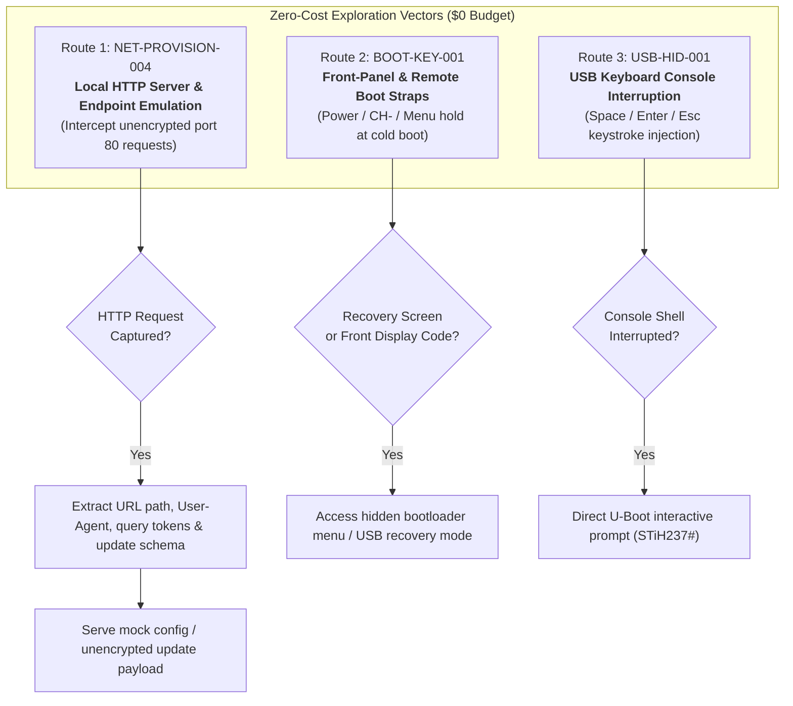

# Project Roadmap: Mero-STB Lab

## Core Mission & Operating Constraints

- **Objective:** Obtain software execution control on the Sagemcom DSI74 V2 HD GVT (STMicroelectronics STiH237 "Cardiff" SoC) and repurpose it as a headless Linux network node (**Mero-STB**).
- **Hardware & Budget Constraint (LOCKED):** **$0 Budget / Zero External Hardware Purchases.**
  - All research, exploration, and exploitation must utilize existing equipment:
    - Main Linux workstation (`192.168.1.97`, interface `enp5s0`)
    - Existing home LAN router (`192.168.1.1`)
    - Sagemcom DSI74 V2 receiver (`192.168.1.137`, MAC `68:15:90:6b:81:96`)
    - Standard TV monitor & OEM remote control
    - Standard USB flash drive (`MERO_STB`, FAT32)
  - Hardware flashing tools (CH341A programmers, SOIC test clips) and dedicated USB-to-UART serial adapters are **shelved/deferred** unless zero-cost alternatives (e.g. soundcard serial or standard PC peripherals) are repurposed.

---

## Milestone History & Status

| Identifier | Focus Area | Status | Outcome / Verdict |
| :--- | :--- | :---: | :--- |
| **USB-PROBE-001** | Blind USB filename probing (`update.bin`, etc.) | **COMPLETED** | **NEGATIVE:** Vendor "updating firmware" boot graphic occurs identically without USB stick. |
| **USB-SCRIPT-002** | Conventional U-Boot script discovery (`boot.scr`) | **COMPLETED** | **NEGATIVE:** Resident bootloader does not auto-load or parse standard scripts from FAT32. |
| **NET-PATH-003** | Bounded bidirectional ARP relay & packet capture | **COMPLETED** | **POSITIVE:** Interception verified. Discovered DNS queries for `ucstb.vivoplay.com.br`, TCP to `186.215.183.217:80` and `191.32.31.251:80/443`, firmware version `1.320.1.0.5`, error `05NW`. |
| **NET-PROVISION-004** | HTTP endpoint emulation & request capture | **COMPLETED** | **POSITIVE:** Captured `GET /tv-config/appConfigFit.json` from `Ekioh v2.2.4.5-sagem` browser; unencrypted JSON parsed. |
| **NET-CONFIG-005** | Mock configuration delivery & custom portal injection | **ACTIVE** | Host crafted `appConfigFit.json` to hijack portal URL & UI navigation to local PC. |
| **BOOT-KEY-001** | Front-panel & remote control boot straps | **QUEUED** | Zero-cost hardware exploration. |
| **USB-HID-001** | USB PC keyboard bootloader interruption | **QUEUED** | Zero-cost console testing. |
| **BOOT-CHAIN-001** | Hardware UART sniffing & SPI flash dumping | **SHELVED** | Requires external flasher / UART adapter (deferred per budget constraint). |

---

## Active Phase Details: Zero-Cost Vectors

### Route 1: NET-PROVISION-004 — Local HTTP Endpoint Emulation (Current Focus)
- **Hypothesis:** When the receiver initiates outbound connections to `186.215.183.217:80` and `191.32.31.251:80` during boot and connection tests, completing the TCP handshake locally will cause the STB to transmit its raw HTTP request (URL paths, User-Agent, device identifiers, and requested configuration/update manifests).
- **Execution Strategy:**
  1. Set up a Python HTTP logging server on the PC (`192.168.1.97:8080`).
  2. Use iptables PREROUTING/DNAT to redirect forwarded port 80 traffic destined for `186.215.183.217` and `191.32.31.251` to `192.168.1.97:8080`.
  3. Optionally resolve `ucstb.vivoplay.com.br` to the PC IP via local DNS responder.
  4. Trigger the network test from the TV menu (`Connection Wizard`).
  5. Inspect full HTTP request headers, query strings, and payloads.

### Route 2: BOOT-KEY-001 — Front-Panel & Remote Control Boot Straps
- **Hypothesis:** Many STiH2xx and Sagemcom STBs incorporate secondary bootloader routines accessible by holding specific physical buttons during cold boot.
- **Physical Controls Available:** Front panel push buttons (`Power`, `CH+`, `CH-`, `Vol+`, `Vol-`) and OEM remote control.
- **Procedures:**
  - Hold `Power` button for 10–15 seconds while connecting 12V DC power.
  - Hold `CH-` button while connecting 12V DC power.
  - Hold `Menu` button on remote pointed at IR receiver while connecting power.
  - Monitor front-panel multi-segment LED display (`UPGD`, `LOAD`, `BOOT`, `FAIL`) and TV HDMI/CVBS output.

### Route 3: USB-HID-001 — USB Keyboard Console Interruption
- **Hypothesis:** If the vendor U-Boot was compiled with `CONFIG_USB_KEYBOARD` enabled, a standard USB PC keyboard connected to the rear USB port can register keystrokes before the OS kernel boots.
- **Procedure:**
  - Connect standard USB computer keyboard to receiver USB port.
  - Power cycle receiver while continuously sending keystrokes (`Space`, `Enter`, `Esc`, `Ctrl+C`).
  - Observe if boot sequence halts or drops into interactive text console.
