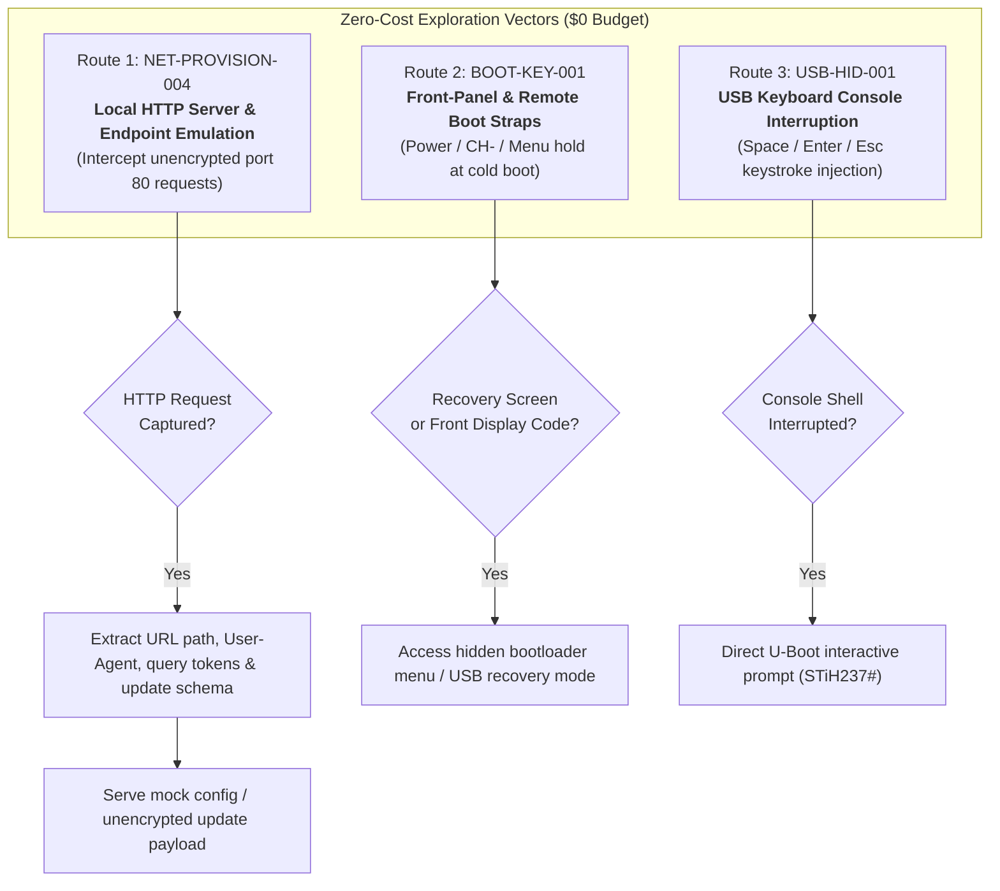

# Project Roadmap: Mero-STB Lab

## Core Mission & Operating Constraints

- **Objective:** Obtain software execution control on the Sagemcom DSI74 V2 HD GVT (STMicroelectronics STiH237 "Cardiff" SoC) and repurpose it as a headless Linux network node (**Mero-STB**).
- **Hardware & Budget Constraint (LOCKED):** **$0 Budget / Zero External Hardware Purchases.**
  - All research, exploration, and exploitation must utilize existing equipment:
    - Main Linux workstation (`192.168.1.97`, interface `enp5s0`)
    - Existing home LAN router (`192.168.1.1`)
    - Sagemcom DSI74 V2 receiver (`192.168.1.137`, MAC `68:15:90:6b:81:96`)
    - Standard TV monitor & OEM remote control
    - Standard USB flash drive (`MERO_STB`, FAT32)
  - Hardware flashing tools (CH341A programmers, SOIC test clips) and dedicated USB-to-UART serial adapters are **shelved/deferred** unless zero-cost alternatives (e.g. soundcard serial or standard PC peripherals) are repurposed.

---

## Milestone History & Status

| Identifier | Focus Area | Status | Outcome / Verdict |
| :--- | :--- | :---: | :--- |
| **USB-PROBE-001** | Blind USB filename probing (`update.bin`, etc.) | **COMPLETED** | **NEGATIVE:** Vendor "updating firmware" boot graphic occurs identically without USB stick. |
| **USB-SCRIPT-002** | Conventional U-Boot script discovery (`boot.scr`) | **COMPLETED** | **NEGATIVE:** Resident bootloader does not auto-load or parse standard scripts from FAT32. |
| **NET-PATH-003** | Bounded bidirectional ARP relay & packet capture | **COMPLETED** | **POSITIVE:** Interception verified. Discovered DNS queries for `ucstb.vivoplay.com.br`, TCP to `186.215.183.217:80` and `191.32.31.251:80/443`, firmware version `1.320.1.0.5`, error `05NW`. |
| **NET-PROVISION-004** | HTTP endpoint emulation & request capture | **COMPLETED** | **POSITIVE:** Captured `GET /tv-config/appConfigFit.json` from `Ekioh v2.2.4.5-sagem` browser; unencrypted JSON parsed. |
| **NET-CONFIG-005** | Mock configuration delivery & custom portal injection | **COMPLETED** | **POSITIVE:** Stock Ekioh rendered a foreground custom SVG application and executed supplied ECMAScript; timers remain unverified. |
| **APP-RUNTIME-006** | Dynamic application and remote-input capability matrix | **COMPLETED** | **POSITIVE:** Continuous SVG/DOM updates, HTTP polling, refreshed frames, and 35 remote key codes demonstrated. |
| **REMOTE-MAP-007** | Named remote-control calibration | **COMPLETED** | 40/40 labels captured; canonical keymap published. |
| **APP-EXIT-008** | Top-level application lifecycle exit | **COMPLETED** | **NEGATIVE:** Browser lifecycle calls and remote/physical power controls did not exit the injected document. |
| **APP-API-009** | Read-only Ekioh capability inventory | **COMPLETED** | **POSITIVE, LIMITED:** Network/storage primitives and `ekiohPlatformInfo` found; common native bridges absent. |
| **APP-API-009B** | Deep Ekioh capability inventory | **COMPLETED** | 128 observations; raw Ekioh connection/server/timer helpers and a scriptable-plugin MIME surfaced for bounded follow-up. |
| **APP-API-009C** | Bounded raw Ekioh connection lab | **COMPLETED, LIMITED** | Real connect/send/receive and listen/close objects found; tested client did not connect and tested listener remained LAN-filtered. |
| **APP-API-009D** | Connection state and native plugin probe | **COMPLETED, LIMITED** | Cross-boot `localStorage` confirmed. Connection calls emitted no SYN; XHTML-in-SVG plugin object was unavailable through the DOM. |
| **APP-API-009E** | Comprehensive runtime capability mapper | **COMPLETED, LIMITED** | Module activation negative; transport signatures inert; storage/XML/standard timer positive; concurrent reports stalled full inventory. |
| **APP-NATIVE-018** | Scriptable-plugin MIME instantiation | **COMPLETED, LIMITED / NEGATIVE** | Controlled SVG script ran; a dynamic XHTML `<embed>` remained an `SVGElement` and `.object` was undefined. |
| **RUNTIME-MAP-009F** | Sequential capability mapper | **COMPLETED, POSITIVE** | Automatic 77-field run completed; native timer objects exposed; exact ARP validation replaced stale ping/neighbor identity. |
| **RUNTIME-PROBE-009G** | Combined runtime behavior probe | **COMPLETED, POSITIVE** | Native timer ran and stopped; UTF-8 binary conversion, DOM events, JSON/storage, intervals, and heap readings verified automatically. |
| **APP-HUB-010** | Persistent in-app experiment hub | **COMPLETED, POSITIVE** | Manifest-driven v1 → v2 replacement, retained run counting, and automatic cleanup verified without replacing the foreground document. |
| **USB-CAP-012** | Application-visible USB and local-file access | **COMPLETED, NEGATIVE/LIMITED** | Five cycles found no readable OS file or USB marker through `XMLHttpRequest` or `getURL`; OS-level USB remains unknown. |
| **FW-UPDATE-013** | Firmware and update-service discovery | **IN PROGRESS** | ARP pass-through retired after LAN disruption. Public Cardiff builds establish a SH4 Linux + `uImage` + UBI/UBIFS reference architecture, but no DSI74-compatible image or verified board map exists. Continue offline package research. |
| **MEDIA-010** | Local media pipeline probe | **COMPLETED, LIMITED** | SVG audio API invoked and WAV fetched; no audible playback. Standard HTML media playback APIs absent. |
| **NETWORK-SERVICE-011** | Exact-device LAN service inventory | **COMPLETED** | All TCP ports silently filtered; UDP probes received no identifying response. |
| **BOOT-KEY-001** | Front-panel & remote control boot straps | **QUEUED** | Zero-cost hardware exploration. |
| **USB-HID-001** | USB PC keyboard bootloader interruption | **QUEUED** | Zero-cost console testing. |
| **BOOT-CHAIN-001** | Hardware UART sniffing & SPI flash dumping | **SHELVED** | Requires external flasher / UART adapter (deferred per budget constraint). |

---

## Active Phase Details: Zero-Cost Vectors

## Application-to-OS Exploration Program

The demonstrated foothold is an Ekioh SVG/ECMAScript application runtime. It supports rendering, timers, HTTP requests, refreshed subresources, and mapped remote input. It does not yet provide a shell, arbitrary native-code execution, unrestricted filesystem access, or direct device access.

1. **APP-EXIT-008 — Application lifecycle exit.** **COMPLETED — NEGATIVE.** Vivo Play reached JavaScript, but `window.close()`, `top.close()`, self-window reopening, `history.back()`, and `history.go(-4)` did not return to native television. Remote and physical power controls also failed while the injected top-level document was active. Cold power removal is the only demonstrated escape.
2. **APP-API-009 — Runtime capability inventory.** **COMPLETED — POSITIVE, LIMITED.** Read-only inventory demonstrated `XMLHttpRequest`, `getURL`, `localStorage`, `sessionStorage`, platform `SagemcomDFB`, and a non-enumerable `ekiohPlatformInfo` object. Standard WebSocket, Worker, FileReader, OIPF, DVB, media, and USB globals were absent.
   **APP-API-009B — COMPLETED, POSITIVE.** The deep inventory captured 128 observations and exposed raw Ekioh helpers including `createConnection`, `createConnectionServer`, `createTimer`, `postURL`, binary conversion helpers, heap metrics, and a scriptable-plugin MIME. Their signatures and security boundaries remain untested; use a bounded APP-API-009C rather than blind invocation.
3. **MEDIA-010 — Native media pipeline.** **COMPLETED, LIMITED.** SVG audio begin/end APIs exist and the receiver fetched the complete local WAV, but no tone was audible. Standard HTML media playback methods were absent. Other codecs and proprietary paths remain open.
4. **NETWORK-SERVICE-011 — Exact-device service inventory.** **COMPLETED — NO LAN-REACHABLE SERVICE IDENTIFIED.** All 65,535 TCP ports silently filtered unsolicited probes. UDP top-200 and targeted protocol probes received no identifying response. Continue with receiver-initiated traffic and firmware evidence rather than broader inbound scanning.
5. **USB-CAP-012 — USB capability matrix.** Test FAT32 storage detection, media discovery, configuration/import files, firmware packages, USB keyboard input, insertion events, local URI access, and application-visible USB APIs. USB-SCRIPT-002 ruled out only the tested automatic U-Boot script path; it did not rule out OS-level USB support.
6. **FW-UPDATE-013 — Firmware and update analysis.** Capture update manifests and packages, determine signing and version rules, and inspect obtainable images for filesystem layout, init configuration, Ekioh integration, and dormant maintenance services. Do not claim an installation path without signature and rollback evidence.
7. **UART-014 — Board-level console investigation.** If software-only surfaces do not expose an OS bridge, identify candidate low-voltage serial pads and pursue boot-log or console access using only existing zero-cost equipment. Avoid transmitting until voltage and pin roles are established.

The preferred execution order is 1 through 7. Each experiment must preserve the distinction between application-runtime capability and operating-system execution.

### Route 1: NET-PROVISION-004 — Local HTTP Endpoint Emulation (Current Focus)
- **Hypothesis:** When the receiver initiates outbound connections to `186.215.183.217:80` and `191.32.31.251:80` during boot and connection tests, completing the TCP handshake locally will cause the STB to transmit its raw HTTP request (URL paths, User-Agent, device identifiers, and requested configuration/update manifests).
- **Execution Strategy:**
  1. Set up a Python HTTP logging server on the PC (`192.168.1.97:8080`).
  2. Use iptables PREROUTING/DNAT to redirect forwarded port 80 traffic destined for `186.215.183.217` and `191.32.31.251` to `192.168.1.97:8080`.
  3. Optionally resolve `ucstb.vivoplay.com.br` to the PC IP via local DNS responder.
  4. Trigger the network test from the TV menu (`Connection Wizard`).
  5. Inspect full HTTP request headers, query strings, and payloads.

### Route 2: BOOT-KEY-001 — Front-Panel & Remote Control Boot Straps
- **Hypothesis:** Many STiH2xx and Sagemcom STBs incorporate secondary bootloader routines accessible by holding specific physical buttons during cold boot.
- **Physical Controls Available:** Front panel push buttons (`Power`, `CH+`, `CH-`, `Vol+`, `Vol-`) and OEM remote control.
- **Procedures:**
  - Hold `Power` button for 10–15 seconds while connecting 12V DC power.
  - Hold `CH-` button while connecting 12V DC power.
  - Hold `Menu` button on remote pointed at IR receiver while connecting power.
  - Monitor front-panel multi-segment LED display (`UPGD`, `LOAD`, `BOOT`, `FAIL`) and TV HDMI/CVBS output.

### Route 3: USB-HID-001 — USB Keyboard Console Interruption
- **Hypothesis:** If the vendor U-Boot was compiled with `CONFIG_USB_KEYBOARD` enabled, a standard USB PC keyboard connected to the rear USB port can register keystrokes before the OS kernel boots.
- **Procedure:**
  - Connect standard USB computer keyboard to receiver USB port.
  - Power cycle receiver while continuously sending keystrokes (`Space`, `Enter`, `Esc`, `Ctrl+C`).
  - Observe if boot sequence halts or drops into interactive text console.
