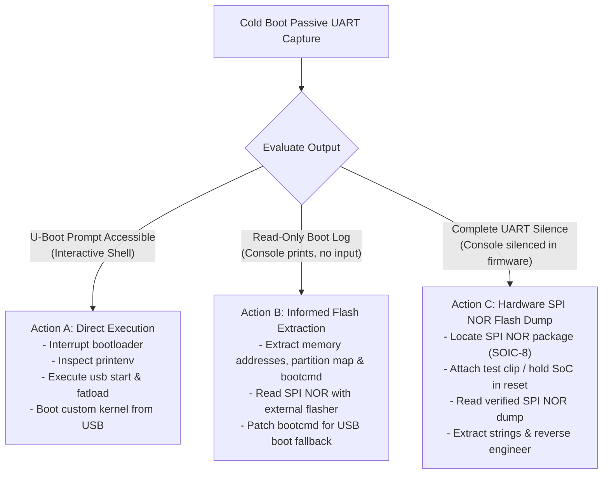

# Investigation Plan: BOOT-CHAIN-001

## Objective
Establish the physical boot-chain topology of the Sagemcom DSI74 V2 HD GVT (PCB: `M74X-1`, `25353567/99-A`), identify the earliest external boot storage, locate hardware debug/communication interfaces, and execute the primary non-destructive probe to achieve early execution visibility.

---

## 1. Schematic Components & PCB Reference Mapping

Based on STiH237 reference designs and Sagemcom M74-1 architectural patterns:

| Functional Role | Candidate IC / Package | Schematic Context | Physical PCB Evidence | Status |
| :--- | :--- | :--- | :--- | :--- |
| **Main SoC** | STMicroelectronics STiH237 (BGA) | Central digital processor | Marked `STiH237` (Cardiff family) under heatsink | **Confirmed** |
| **System DRAM** | Elpida J4216EFBG (FBGA) | Length-matched high-speed DDR bus | Marked `ELPIDA J4216EFBG...` (DDR3) | **Confirmed** |
| **Main Storage** | Micron BGA (FBGA63) | SLC NAND flash interface | Marked `3QD17...` adjacent to SoC | **Pending part decode** |
| **Display/Key Scan**| Princeton Tech PT6958 (SOP-28) | Front-panel peripheral bus | Marked `PT6958 TSK06T` | **Confirmed peripheral** |
| **Early Boot Flash**| Serial SPI NOR Flash (SOIC-8 / WSON-8) | SPI controller, Chip Select 0 (`SPI_CS0#`) | 8-pin package near SoC (tentatively `MX25L1606E`) | **Needs PCB/schematic match** |
| **Boot Mode Straps**| Resistor divider networks | Pull-up/pull-down on boot config pins | SMD resistor pairs near SoC | **Under inspection** |
| **Console UART** | 3-4 pad header or inline test points | Asynchronous serial bus (3.3V TTL) | Unpopulated header pads / labeled test pads | **Target of Probe 001** |
| **JTAG Port** | Test pad cluster (BF16-BG18 balls) | 1.8V JTAG test access port | Test pads on underside/top of PCB | **Mapped (1.8V logic)** |

---

## 2. Earliest External Boot Storage Identification

On the STMicroelectronics STiH237 platform:
1. **The Internal BootROM** executes first at power-on reset.
2. It evaluates hardware boot strap pins to determine the initial boot source.
3. In consumer satellite set-top boxes of this generation, the initial boot source is almost universally the **SPI NOR Flash**.
4. The SPI NOR contains:
   - Early initialization code / First-Stage Bootloader (FSBL).
   - Clock tree, PLL, and DDR3 memory calibration parameters.
   - Secondary bootloader binary (**Das U-Boot**).
   - Bootloader environment block (`bootcmd`, `bootargs`, console configuration).
5. The large parallel/SLC NAND flash holds the secondary payload (kernel, root filesystem, and middleware).

**Conclusion:** The **SPI NOR Flash** is the earliest external nonvolatile boot device.

---

## 3. Hardware Debug & Test Access Points

### A. Console UART (Primary Target)
- **Signal Characteristics:** Standard asynchronous serial, 8 data bits, 1 stop bit, no parity, 115200 baud default.
- **Logic Level:** Typically 3.3V TTL.
- **Idle State:** UART TX sits high at logic 1 (3.3V) when idle.

### B. JTAG (Secondary / Fallback Target)
- **Signal Characteristics:** TDO (`BF16`), TDI (`BF17`), TCK (`BG16`), TRST# (`BG17`), TMS (`BG18`).
- **Logic Level:** **1.8V logic levels**. Must never be probed with 3.3V/5V equipment directly.

---

## 4. Primary Next Physical Experiment: Non-Invasive UART Sniffing

Rather than desoldering chips or executing invasive write procedures, our primary next experiment is **passive serial console interception**:

### Execution Protocol

```text
[Step 1: Visual Inspection]
Inspect PCB top and bottom surfaces for:
  - 3-pin or 4-pin unpopulated headers (often labeled J1, J2, JP1, or UART)
  - Inline arrays of test pads (labeled TP_TX, TP_RX, or unlabelled)

[Step 2: Electrical Verification (Unpowered)]
  - Connect multimeter in continuity mode between chassis GND (e.g. HDMI shield) and candidate pins.
  - Positively identify GND (0 ohms to shield).

[Step 3: Voltage Verification (Powered)]
  - Re-seat SoC heatsink.
  - Power on receiver with 12V supply.
  - Measure DC voltage on remaining candidate pins with multimeter against GND.
  - Look for a pin sitting at ~3.3V DC (classic UART TX line held in mark/idle state).
  - Verify no pins exceed 3.3V (safety check).

[Step 4: Passive Log Capture]
  - Connect GND of a 3.3V USB-to-UART adapter to board GND.
  - Connect RX of the USB-to-UART adapter to the candidate board TX pad.
  - DO NOT connect the adapter's VCC/5V/3.3V power output to the board.
  - Open terminal listener at 115200 baud 8N1:
      minicom -D /dev/ttyUSB0 -b 115200
  - Cold-boot the receiver and observe output.
```

---

## 5. Decision Matrix & Action Thresholds



### Strategic Value
This experiment carries zero risk of bricking, preserves the existing working firmware, requires only standard lab multimeter and USB-UART adapter, and definitively resolves whether the easiest route to code execution (an interactive bootloader prompt) is already present.
